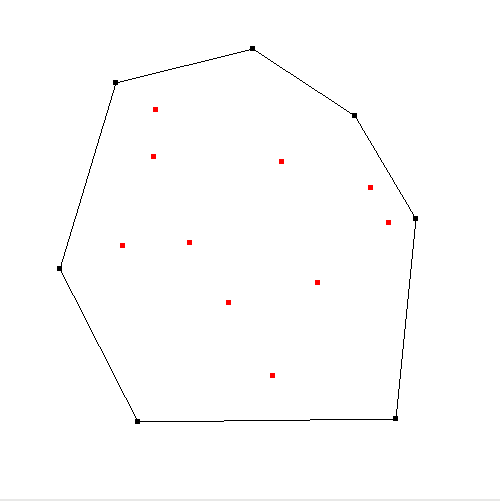

# Graham and Jarvis Hull Algorithms

Using OpenGL, the objective is to build an application that implements Graham Scan and Gift Wrapping algortihms.

The 2 algorithms are:
- [Gift-Wrapping Algorithm (Jarvis Hull)](https://en.wikipedia.org/wiki/Gift_wrapping_algorithm)
- [Graham Scan](https://en.wikipedia.org/wiki/Graham_scan)



As in the above image, the algorithm will take an array of points and return the shape of the convex hull - the points on the outside.

```
make
./lab4 test1
```

